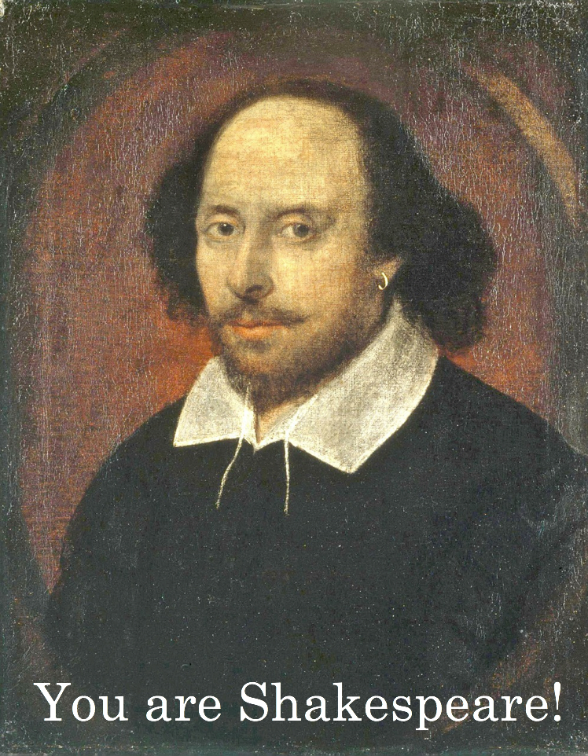
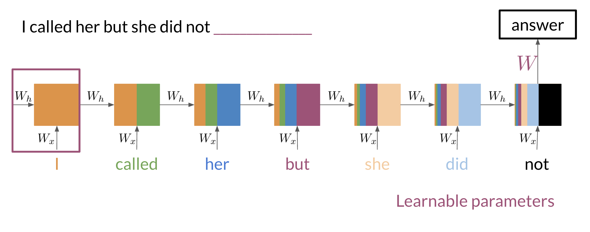

# Shakspere-Poem-generator

## Overview

This project is my exploration of Natural Language Processing (NLP) to generate poetry in the style of Shakespeare. It’s been a journey of learning and experimenting with various NLP techniques to capture the essence of Shakespeare's words. Here, I'll share both what the project accomplishes and my personal experience.

## My Learning Journey

I started with understanding the basics of NLP, such as tokenization and text preprocessing, but soon realized I needed more advanced techniques to capture the intricate style of Shakespeare. I began by learning about n-grams, which provided a basic way to predict the next word. However, for Shakespearean poetry, I needed something more sophisticated to capture long-term dependencies and flow.

Using RNN, GRU, and LSTM

To address this challenge, I explored Recurrent Neural Networks (RNNs), which are suited for sequential data like text. RNNs maintain a form of memory, but I encountered the "vanishing gradient problem," which hindered the ability to remember long sequences. This led me to experiment with Gated Recurrent Units (GRUs) and Long Short-Term Memory (LSTM) networks. LSTMs, in particular, were effective in retaining context over long passages, which helped maintain the cohesion and flair needed for Shakespearean poetry.

## The Process

The workflow involved:

Data Collection & Preprocessing: I gathered a corpus of Shakespeare's works and cleaned the text.

N-gram Exploration: I started with a basic n-gram model to understand statistical text generation.

Deep Learning with RNNs, GRUs, and LSTMs: I trained different models, gradually improving the generated text.

Training and Fine-Tuning: I tweaked hyperparameters and analyzed outputs to align with Shakespearean style.

## Challenges and Reflections

One challenge was ensuring the generated poetry had meaning rather than just being a string of Shakespearean words. The shift from n-grams to deep learning models was a steep learning curve but very rewarding. Balancing creativity and coherence was key—sometimes the model produced lines that were beautiful but nonsensical, reminding me of the complexity of human language.

## Conclusion

This project has been an educational journey, taking me from NLP fundamentals to advanced neural networks like LSTMs. Watching the model learn to generate text that echoes Shakespeare’s voice has been gratifying. While not perfect, each iteration showed the power of modern NLP techniques.

## Feel free to explore the code and experiment with generating your own poetry. The journey of teaching a machine to create poetry is full of challenges and rewards—just like poetry itself.
